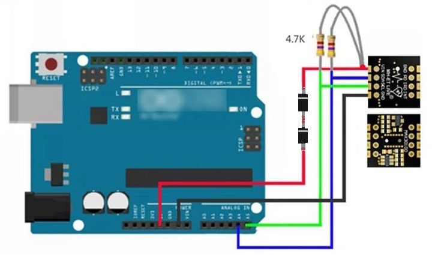

# max30100
Circuito utilizando a placa MAX30100 da MH-ET LIVE para aula da disciplina de TI na Saúde. com o objetivo de apresentar IoT na saúde.

Informações sobre o módulo sensor podem ser encontrados no [site do fabricante](http://mh.nodebb.com/topic/43/new-heart-rate-sensor-mh-et-live-max30100)

A seguir uma imagem do módulo

## Valores máximos absolutos

ddp VDD - GNS: -0.3V a +2.2V
ddp GND - PGND: -0.3V +0.3V
x_DRV, x_LED+ - PGND: -0.3V +6.0V
Todos os pinos - GND: -0.3V +6.0V
consumo de corrente nos terminais: +/- 20mA

## Ligação com o arduino

## Programação
Para visualização das informções utilizando o sistema para IoT [Saiot](https://saiot.ect.ufrn.br) basta utilizar o código neste repositório alterando as credenciais presentes no código fonte principal para as mesmas credenciais do sistema da universidade pois o usuário e seus dispositivos compartilham a mesma forma de autenticação.

Com o objetivo de facilitar o uso do sistema  e o desenvolvimento de novos dispositivos foi desenvolvido, pela equipe de sistemas embarcados do projeto, uma biblioteca que pode ser baixada na página do [github](https://github.com/daniellycosta/SaiotDevice)

Para detalhes do sistema 
Para utilizar o sensor é necessário baixar da biblioteca do github e extrair na pasta de bibliotecas da IDE ou do projeto.
A biblioteca pode ser encontrada no [github da fabricante](https://github.com/MHEtLive/MH-ET-LIVE-max30100)

Neste projeto já estão inclusos a biblioteca e o código fonte foi retirado do exemplo "MAX30100_Minimal".

## Referência

http://mh.nodebb.com/topic/43/new-heart-rate-sensor-mh-et-live-max30100

https://github.com/MHEtLive/MH-ET-LIVE-max30100

https://saiot.ect.ufrn.br